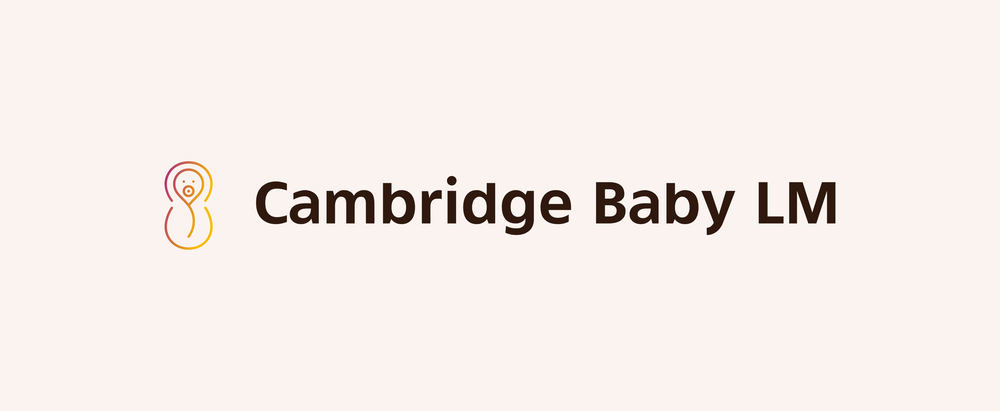

# CLIMB - Curriculum Learning for Infant-inspired Model Building

Cambridge University & Collaborator's submission to the [Baby LM Challenge](https://babylm.github.io/) (strict track). The Baby LM challenge requires teams to train language models on the same amount of data that a child might plausibly see (on the order of 10 million words). 

The accompanying paper to this codebase is titled: **Curriculum Learning for Infant-inspired Model Building**.

In our submission to the Baby LM challenge, we explore different curriculum learning methods that simulate how humans learn languages. In particular, we define three different types of curriculum learning (vocab curriculum learning, data curriculum learning and objective curriculum learning) that each tweek a central aspect of the machine learning pipeline: the data processing, the data sampling and the objective function. The results of our experiments are summarized in our paper. 

## Setup 

To get setup create a hugging face account and ask @rdiehlmartinez to add you to the group's private hugging face hub. The hub is where we keep data, tokenization, model and other artifacts. During training, we pull in these values directly from the hub (and occasionally also push progamatically to the hub). 

In order to interact with the hub, you need to generate read and write [access tokens](https://huggingface.co/docs/hub/security-tokens) from your hugging face account. Once generated, store these values as environment variables with the names HF_READ_TOKEN, and HF_WRITE_TOKEN in a file called `.env`.

You will also need to ask @rdiehlmartinez to add you to the wandb (weights and biases) baby-lm project. We use wandb to log out metrics generated by our runs. Once you've joined the group, you will need to go to wandb to retrieve your [API key](https://wandb.ai/authorize). You will be prompted for this key calling the `./setup.sh` (see below).

Before running the code, make sure to run the setup script `./setup.sh`. This script sets up the requirements imports as well as git hooks for automatic code formatting. Additionally, this script makes sure you are logged into wandb and huggingface.

## Overview 

The entry point to the codebase is the `train.py` file. This file expects to receive a hydra-style config file that stores all relevant parameters for the dataset, data processing, tokenization, and model training. [Hydra](https://hydra.cc/docs/tutorials/structured_config/intro/) provides a system for structuring config files in a hierarchical, decomposable format.

In the subsequent section, we outline the high-level structure of our code-base. 

### Config Files
Under `/src/config.py` you will find the general structure of the hydra config file that our program expects. The purpose of explicitly defining the structure of the config in this manner is two fold 1) to show the user the set of available configurable options 2) to run type-checking on passed in configs, ensuring that the parameters and their types match this pre-defined format. 

We run automatic type-checking on all the passed in config files, and also check that there are no missing required parameters of the config file. If there are, we raise an error.

The `/conf` directory stores all the default configs and subconfigs. The entry point to the default config we use is `conf/config.yaml`. Taking a look at the `conf` directory, you will notice that each sub-directory of `conf` (i.e. `conf/data_curriculum`) stores a sub-configuration. One feature that stands out is that we separate three types of curriculum learning sub-configurations (one for `vocab_curriculum`, one for `data_curriculum`, and one for `objective_curriculum`) -  The first establishes strategies for dynamically masking out vocabulary units over the course of training. The second enables dynamically sampling the training data according to some difficulty function which is updated throughout training. The third method provides functionality for changing the objective function at specified, discrete training steps.

#### Specifying either a vocab- or data-driven curriculum learning strategy 
In order to specify either a vocab- or a data-driven training curriculum, you must set a `pacing_fn` as well as `pacing_fn_kwargs`. The pacing function is one of `['linear', 'quad', 'root', 'step', 'exp', 'log']` or `None`. This function controls the rate at which the training loop will - depending on the type of curriculum - increase either the amount of vocab units unmasked (in the case of vocab curriculum learning) or the data difficulty that is sampled at each training step (in the case of data curriculum learning). The keyword arguments passed in the dictionary `pacing_fn_kwargs` control (1) `start_percent`: the percentage of the dataset which is seen until the curriculum learning protocol is actigvated (2) `num_steps`: the number of steps over which the pacing function will be active, thus defining the curriculum learning region, and (3) `end_percent`: the percentage of the `num_steps` at which to stop curriculum learning.

When using a vocab curriculum learning, users must additionally specify the name of the vocab curriculum, `vocab_curriculum_name`. 

When using a data curriculum learning, users must additionally specify the name of the difficulty scorer, `difficulty_scorer_name`. The difficulty scorer function should be the name of a feature in your dataset by which you want to order your data. By default, the Trainer will sort data in an ascending fashion, i.e. in increasing difficulty w.r.t this feature. This could be n_gram_perplexity, sentence_length, etc. You can also specify additional kwargs, `difficulty_scorer_kwargs`, that should be passed to the scoring function.

#### Specifying an objective-driven curriculum learning strategy 
Specifying an objective-driven curriculum is slightly more involved than specifying either a vocab- or data-driven curriculum. For objective-driven curricula you need to first specify a general strategy, by creating a new `<strategy_name>.yaml` in the `conf/objective_curriculum` directory. This strategy stores information relating to what objectives will be used over the course of training and when to switch the training objective. Each training objective - what we call objective units - that you plan to use over the course of training also needs to be specified. These could be "mlm", "pos", or other custom objectives specified by config files in the `curriculum/units` dir. The strategy config is where you define a dictionary `steps`, which maps integer training step spans over which each objective unit is active. 

### DataLoading 

We define a CustomDataLoader in `/src/dataloader.py` that subclasses the normal hugging face Dataloader class. In the CustomDataLoader, unlike in the normal DataLoader, we are able to keep track of the global step number of training (i.e. how many batches of training data have already been trained on). This information is useful because it allows us to configure special behavior of the DataLoader for different parts of training -- this is key for implementing the vocab-, data-, and objective- curricula. 

 In particular, when the CustomDataLoader goes to yield a next batch of data, we enable the DataLoader to check whether at the current step it should apply a different collator function to preprocess the data for a given (perhaps new) objective function. 

Thus, the CustomDataLoader is where the main logic for objective-driven curricula is implemented.  

### Vocab Curriculum Learning 

All classes associated with vocab curriculum learning are organized under `/src/vocabulary_curriculum`. The main idea behind our curriculum learning approach is to implement a mapping function that at a given step can take the output of the data loader and map certain vocab units to `unk`. The vocab curriculum learning also relies on a pacing function to determine the amount of vocab units that should be masked. This is all supported by the fact that the data loader has access to the current global training step. 

### Data Curriculum Learning -- DataSampling 

All classes associated with data curriculum learning are organized under `/src/data_curriculum`. The data curriculum is powered by our custom CurriculumSampler. As is standard, when we initialize the CustomDataLoader we pass it an instance of the CurriculumSampler. Just like the CustomDataLoader has access to a global step so to the CurriculumSampler stores the current global step of training, in order to adapt its sampling behavior conditioned on the current training step. The CurriculumSampler uses this information in order to determine if it should sample the indices for the next batch of samples from a smaller subsample of the total dataset. The purpose for this is so that the CurriculumSampler is forced to sample early in training easier, easier training samples (and over the course of training progressively ramp up the difficulty of the samples). The CurriculumSampler has access to a pacing function (`pacing_fn`) that it uses to determine the overall maximal difficulty of samples that it can draw at any given global step number.

### The Objective Function 

We define anything to do with the objective function currently inside of the `src/objective_curriculum` module. The objective curriculum is organized around an orchestrator class `ObjectiveCurriculum` that - just like the data loader - maintains the current global step and uses that information to determine which objective units should be activated. The `ObjectiveCurriculum`, when queried, can then return individual objective units which are implemented under `src/objective_curriculum/units`. Each unit stores its own weights associated with the task head for the objective it implements, as well as an optimizer and scheduler. During training when data is fed through the model we first compute the hidden state of the model for a given batch of data and then pass those hidden states on to each of the task units. 

### Preprocessing and Tokenization

Other useful methods for data preprocessing, tokenizer and inference can be found under `src/utils`.

### Evaluation

The evaluation of the model on GLUE and BLIMP tasks is done by calling on third-party libraries that are part of the submodules of this project.

### Model Architecture 

For most of our experiments, we use variants of Roberta language models. The architectures and the associated configurations are specified under `/src/models`. To associate a model name with a given huggingface model and an assocaited config, we store a registry inside of the `models` package. When we load a model we query this registry. 
